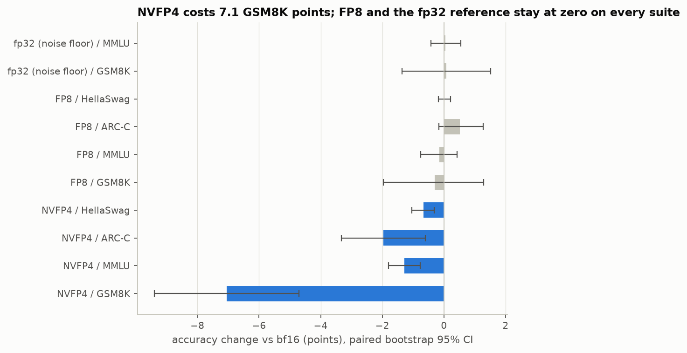
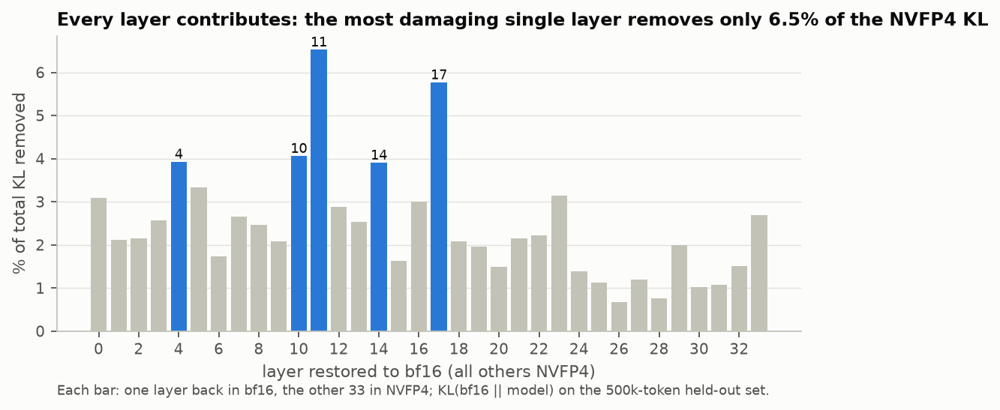
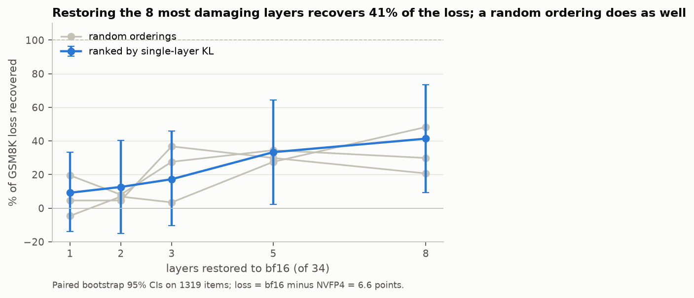
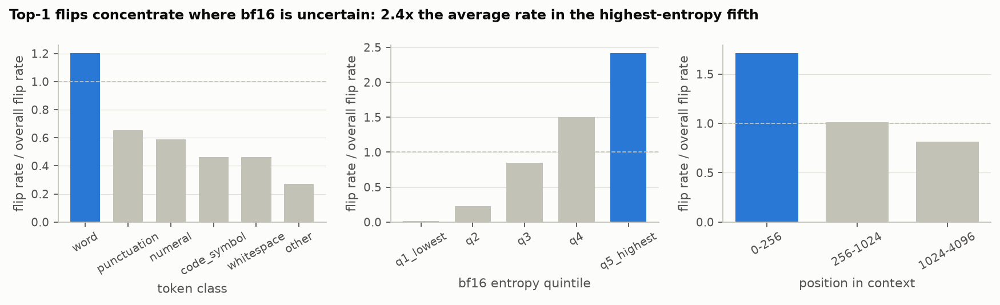
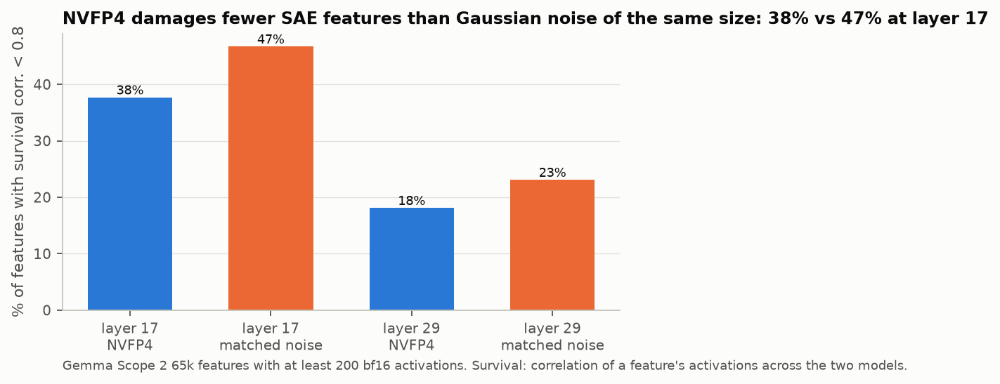
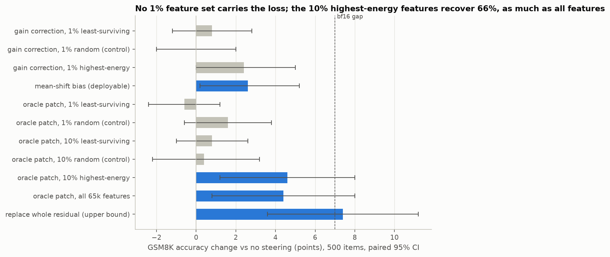
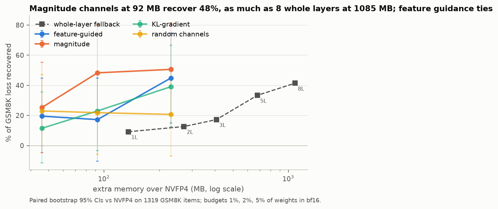

# Where, what and how NVFP4 quantization damages Gemma 3 4B

A mechanistic study of 4-bit (NVFP4) and 8-bit (FP8) weight quantization of `google/gemma-3-4b-pt`, run as a
one-day sprint on 2026-10-05 (one H100 for setup and statistics, then an 8x H100 box for about 2.5 hours).
Every number below carries a paired bootstrap 95% confidence interval and sits next to its control. Null results
are reported with the same prominence as positive ones. The number ledger is `results/LEDGER.md` (written only by
scripts), the running log of findings is `docs/FINDINGS.md`, and every figure is regenerated from results JSON by
`scripts/figures/make_all.py`.

## Summary

NVFP4 round-to-nearest (4.5 bits per weight, blocks of 16, E4M3 block scales) costs Gemma 3 4B about 7 GSM8K
points and 1.3 MMLU points; FP8 per-channel costs nothing measurable. We then asked where the damage lives.

- **Layers: nowhere in particular.** Restoring the 8 most damaging layers to bf16 (24% of the network, 1.1 GB of
  extra memory) recovers 41% [9%, 74%] of the GSM8K loss; a random choice of 8 layers recovers 48%. The KL-based
  layer ranking never beats random. The best single layer removes 6.5% of the KL.
- **Tokens: where the model is uncertain.** Top-1 flips concentrate in the highest-entropy fifth of positions
  (2.4x the average flip rate), on non-Latin tokens, and in the first 256 tokens of a document (3.9x the median
  KL), not at long range.
- **Features: not the damaged ones.** With Gemma Scope 2 SAEs, NVFP4 pushes 38% of layer-17 features below a
  survival correlation of 0.8, fewer than Gaussian noise of the same size (47%). But restoring those features to
  their bf16 values, even 10% of the dictionary, recovers nothing. The accuracy-relevant damage sits in the 10%
  highest-energy (frequent, dense) features: patching them recovers 66% of the bf16 gap, the same as patching all
  65k features. The remaining third is in the SAE's reconstruction error. Replacing the whole layer-17 residual
  stream restores bf16 accuracy although layers 18 to 33 stay quantized.
- **Fix: thin and spread out beats thick and local.** Keeping 2% of weights in bf16, chosen by magnitude and
  spread over every matrix (92 MB), recovers 48% of the GSM8K loss, as much as 8 whole layers at 12x the memory.
  The SAE-derived saliency ties with magnitude, KL-gradient and random channels under the pre-registered rule.
  The best deployable activation-level fix is a constant mean-shift bias at layer 17 (+2.6 [+0.2, +5.2] points).

The through-line: NVFP4 damage in this model is diffuse at every level we measured, layers, tokens, features and
weights. It is not a few broken components but a small shift everywhere, and interventions work in proportion to
how much of the stream they touch.

## Setup

| Item | Choice |
| --- | --- |
| Model | `google/gemma-3-4b-pt`, text-only, 34 layers, d_model 2560, 238 quantizable matrices (3.21B weights) |
| NVFP4 (Q1) | round-to-nearest, W4A16, blocks of 16 along the input dimension, E4M3 block scale, FP32 tensor scale, shared global scale for fused q/k/v and gate/up. Quantize-dequantize in bf16, verified bit-exact against llm-compressor's `NVFP4A16` export on all 238 matrices |
| FP8 (Q3) | E4M3 per-channel, W8A16 |
| Controls | fp32 reference (noise floor), Gaussian noise with the per-matrix Frobenius error matched to NVFP4 (C2), NVFP4 error entries permuted within each matrix (C3), random layer orderings, random feature sets, random channel sets |
| Evaluation | GSM8K 8-shot CoT (strict match, 1319 items), MMLU 5-shot (full, and a 70-per-subject subset of 3990 items for sweeps), ARC-Challenge and HellaSwag (0-shot, acc_norm); vLLM engine for checkpoints, transformers for hooked models (agreement check: -0.2 [-1.3, +1.0] points) |
| Distance | KL(bf16 || quantized) per token over the full 262k vocabulary, 2M held-out tokens (FineWeb-Edu, WikiText, GSM8K train, Python code), PG-19 to 32k tokens |
| SAEs | Gemma Scope 2 `resid_post`, width 65k, L0 medium, layers 17 and 29; two self-trained BatchTopK SAEs at layer 17 (32k features, k = 64, 100M tokens, on bf16 and on NVFP4 activations) |
| Statistics | paired bootstrap over items (10k resamples) for every accuracy delta, document-level cluster bootstrap for KL, pre-registered decision rules |

Weighted relative Frobenius error of the weights: 9.5% for NVFP4, 2.6% for FP8. NVFP4 zeroes 7.2% of all weights,
exactly the fraction that falls below 1/24 of its block's maximum ("block-outlier shadowing": a bound derived
from the E2M1 grid predicts the zeroing rate to 0.01%).

## Phase 0: how much damage

| Condition | GSM8K | MMLU | ARC-C | HellaSwag |
| --- | --- | --- | --- | --- |
| bf16 | 40.5 | 59.6 | 54.5 | 75.8 |
| NVFP4 | -7.05 [-9.40, -4.70] | -1.29 [-1.80, -0.77] | -1.96 [-3.33, -0.60] | -0.67 [-1.04, -0.32] |
| FP8 | -0.30 [-1.97, +1.29] | -0.15 [-0.75, +0.43] | +0.51 [-0.17, +1.28] | +0.02 [-0.18, +0.21] |
| fp32 (noise floor) | +0.08 [-1.36, +1.52] | +0.05 [-0.43, +0.55] | | |

Deltas in accuracy points against bf16, paired bootstrap 95% CI. Under NVFP4, 19.8% of GSM8K answers change
(13.4% correct to wrong, 6.4% wrong to correct) for a 7-point net loss; numerically near-identical models (bf16 vs
fp32) already flip 7% of items. On the 500k-token held-out set NVFP4 has mean KL 0.081 nats and disagrees with
bf16 on the top-1 token 12.3% of the time; FP8 has median KL 0.004 and 95.5% top-1 agreement. The headline
replicated on a second machine within half a point (bf16 40.4, NVFP4 33.8, loss 6.60 [4.25, 8.95]).

## Phase 1: where (layers and tokens)

Restoring one layer at a time to bf16 and measuring the KL removed gives a ranking (11, 17, 10, 4, 14, 5, 23, 0,
...). The effects are small and near-additive: the best layer removes 6.5% of the KL, the top five about 24%, and
the 34 single-layer effects sum to 83% of the total. Global-attention layers (5, 11, 17, 23, 29) are about twice
as sensitive as local ones (4.2% vs 2.1% of KL per layer, permutation p = 0.0025).

At the accuracy level the ranking has no value over chance. Restoring the top 1 / 2 / 3 / 5 / 8 ranked layers
recovers 9% / 13% / 17% / 33% / 41% of the GSM8K loss; a random ordering recovers 48% at N = 8 (37.0 vs 36.5
accuracy), and ranked minus random is never significant at any N. Neither 50% nor 80% recovery is reached with 8
layers. **Claim "a minority of layers carries most of the loss": not supported.**

Per token (2M general tokens plus GSM8K), top-1 flips concentrate where bf16 is uncertain: the highest-entropy
fifth of positions flips 2.4x the average rate and has 2.7x the median KL, the lowest fifth 0.01x. Non-Latin tokens
have 2.6x the median KL. Numerals look robust overall (0.59x flips) because most digits are low-entropy, but at
matched uncertainty they flip 1.9x the average and code symbols 1.4x. In PG-19 documents to 32k tokens the median
KL is 3.9x the overall median in positions 0 to 256, 1.7x in 256 to 1024, and flat beyond: a context-scarcity
effect, not a long-context one. A tuned lens trained on 10M tokens shows the quantized model's intermediate
predictions diverging from bf16's from layer 17 onward.

## Phase 2: what (SAE features)

Gemma Scope 2 SAEs remain valid rulers across the two models: at layer 17 they explain 95.8% of the residual
variance for bf16 and 95.4% for NVFP4 (79.7% vs 78.6% at layer 29), with L0 within one feature.

**Shift accounting over 12.25M tokens.** At layer 17 the SAE basis captures 98% of the squared residual shift
||h_nvfp4 - h_bf16||^2, with the SAE error term at 11%. Per-feature shift energy is extremely concentrated (top 1%
of features = 63% of the summed energy, Gini 0.94), but the matched-noise control shows the identical curve (62.6%,
Gini 0.945): the concentration is a property of the SAE basis (a few very frequent, very large features), not of
quantization, and the pre-registered claim was withdrawn. At layer 29 the SAE explains 84% of the shift and about
half of the shift energy lies along one direction under both NVFP4 and noise.

**Survival.** The correlation of each feature's activations across the two models separates the conditions.
Among 27,106 layer-17 features with at least 200 bf16 activations, NVFP4 pushes 12.7% below 0.5 and 37.7% below
0.8 (median 0.86); Gaussian noise of the same Frobenius error pushes 22.4% and 46.7% (median 0.82). Damaged
features are rare and small (median 558 activations vs 5,174 overall), matching the finding of Duan (2026) that
survival is predictable from full-precision statistics. NVFP4 amplifies more features than it suppresses (6,330 vs
2,168); noise mostly suppresses. At layer 29 only 0.5% of features fall below 0.5 under NVFP4.

**Interventions at layer 17** (500 GSM8K items, paired against the same model with no hook; NVFP4 alone 34.6,
bf16 on the same items 41.6):

| Intervention | Features | Delta (points) |
| --- | --- | --- |
| Gain correction on the 1% least-surviving features (deployable) | 641 | +0.8 [-1.2, +2.8] |
| Gain correction on 1% random features (control) | 641 | +0.0 [-2.0, +2.0] |
| Gain correction on the 1% highest-energy features | 641 | +2.4 [+0.0, +5.0] |
| Mean-shift bias, estimated on 64 calibration sequences (deployable) | | +2.6 [+0.2, +5.2] |
| Oracle patch (set to bf16 values): 1% least-surviving | 641 | -0.6 [-2.4, +1.2] |
| Oracle patch: 1% random (control) | 641 | +1.6 [-0.6, +3.8] |
| Oracle patch: 10% least-surviving | 6,411 | +0.8 [-1.0, +2.6] |
| Oracle patch: 10% random (control) | 6,411 | +0.4 [-2.2, +3.2] |
| Oracle patch: 10% highest-energy | 6,411 | +4.6 [+1.2, +8.0] |
| Oracle patch: all 65,536 features | 65,536 | +4.4 [+0.8, +8.0] |
| Replace the whole layer-17 residual with bf16's | | +7.4 [+3.6, +11.2] |

Gain correction on the damaged features was expected to be null: their mean active value changes by under 5%
(the gains are 0.95 to 1.10), so NVFP4 does not shrink them, it changes when they fire. Restoring them, even 10%
of the dictionary with oracle access to bf16, does nothing for accuracy. The recoverable damage sits in the 10%
highest-energy features, which carry as much as the whole basis (66% of the gap); the remaining third is in the SAE
error term. The whole residual at layer 17 carries 106%: the loss is fully formed by layer 17 and the quantization
of layers 18 to 33 adds nothing measurable on GSM8K. **Claim "a small fraction of features carries the shift and
restoring it recovers accuracy": not supported for the damaged features; the damage that matters is spread across
the frequent, high-energy part of the basis.** The best deployable fix is the simplest, a constant bias.

**Self-trained SAEs.** Two BatchTopK SAEs (32k features, k = 64) trained on 100M tokens of bf16 and of NVFP4
activations reach 3.5% and 2.5% unexplained variance, with about 7.7k live features each (three quarters died
during training), so they act as dictionaries of frequent features. Used as a second ruler, the bf16-trained SAE
reproduces every qualitative result: its basis explains 96% of the shift, the energy concentration and the single
dominant direction are identical under matched noise (basis properties), and NVFP4 damages fewer features than
noise (2.4% vs 4.9% below a survival correlation of 0.8). Fragility is a property of rare features: this
dense-feature dictionary sees a tenth of the feature-level damage that Gemma Scope's 65k dictionary reports.

## Phase 3: fix (mixed precision at equal memory)

Four ways to choose which weight rows and columns stay in bf16, at budgets of 1%, 2% and 5% of the 3.21B weights
(46, 92 and 231 MB extra over NVFP4 at 1.44 bytes per protected weight), against whole-layer fallback (136 MB per
layer). Recovery is the share of the GSM8K loss recovered, paired against NVFP4 on 1319 items.

| Method | 1% (46 MB) | 2% (92 MB) | 5% (231 MB) |
| --- | --- | --- | --- |
| Feature-guided (SAE decoder directions projected onto weight errors) | 20% (+1.3 [-0.3, +3.0]) | 17% (+1.1 [-0.7, +3.0]) | 45% (+3.0 [+1.0, +4.9]) |
| Magnitude (AWQ-style) | 25% (+1.7 [-0.3, +3.6]) | 48% (+3.2 [+1.1, +5.3]) | 51% (+3.3 [+1.4, +5.4]) |
| KL-gradient | 11% (+0.8 [-0.8, +2.4]) | 23% (+1.5 [-0.2, +3.3]) | 39% (+2.6 [+0.8, +4.4]) |
| Random channels | 23% (+1.5 [+0.0, +3.1]) | 22% (+1.4 [-0.4, +3.3]) | 21% (+1.4 [-0.5, +3.3]) |
| Whole-layer fallback | 1 layer (136 MB): 9% | 5 layers (678 MB): 33% | 8 layers (1085 MB): 41% |

Channel-level protection beats whole-layer fallback at equal memory: magnitude at 92 MB matches 8 whole layers at
1,085 MB, and whole-layer fallback never reaches 45% within 8 layers. Under the pre-registered rule (a paired win
at two of the three budgets) the feature-guided saliency **ties** with magnitude (-0.4, -2.0, -0.4 points), with
KL-gradient and with random channels; the SAE information does not improve on the weight magnitudes. MMLU deltas
are all within noise (the MMLU loss is only 1.3 points). 80% recovery is not reached at any budget up to 5%.

## What this means

1. The common mental model "quantization breaks a few sensitive layers or features; find and protect them" does
   not describe NVFP4 on Gemma 3 4B. Every layer contributes a little, the damaged SAE features are rare and
   irrelevant for accuracy, and the accuracy-relevant shift is spread over the dense, frequent part of the
   representation. Random orderings, random feature sets and random channel sets are strong baselines here, and any
   paper that omits them would overstate its localization claims.
2. What does work is proportional: patch more of the stream, recover more. A constant bias at one layer recovers a
   third of the loss for free at inference; protecting 2% of weights spread over all matrices recovers half.
3. NVFP4 is gentler than isotropic noise of the same size at the feature level (fewer features lose their
   identity), consistent with its error being structured (block scaling, shadowing of small weights) rather than
   random, yet the two produce the same macroscopic shift structure in the SAE basis.
4. GSM8K is the sensitive suite; MMLU, ARC and HellaSwag barely move. Studies of 4-bit damage should lead with
   multi-step generation tasks.

## Resume lines (as supported by the evidence)

- Built a bit-exact NVFP4 quantization instrument for Gemma 3 4B (verified against llm-compressor on all 238
  matrices) and measured its damage with paired-bootstrap CIs on four suites: 7.1 GSM8K points, 1.3 MMLU, with FP8
  and an fp32 reference as null controls.
- Showed with layer-restore sweeps, per-token KL analysis, tuned lens and Gemma Scope 2 SAEs (plus two self-trained
  SAEs) that the damage is diffuse: no layer subset beats random, restoring the 10% most damaged features recovers
  nothing, while the 10% highest-energy features carry two thirds of the recoverable loss and a single bias
  correction recovers a third.
- Designed a feature-guided mixed-precision scheme and benchmarked it against magnitude, KL-gradient, random and
  whole-layer baselines at equal memory: channel-level protection at 92 MB matched whole-layer fallback at 1.1 GB,
  and the SAE-guided variant tied with magnitude under a pre-registered test.

## Limitations

- One model, one quantizer setting (round-to-nearest; GPTQ-style NVFP4 and W4A4 are extended scope).
- Interventions and the feature-level curve use a 500-item GSM8K subset; CIs are correspondingly wide (about
  plus or minus 2 points).
- Native NVFP4 kernel validation on Blackwell hardware was deferred; the bit-exact match against llm-compressor's
  export stands in for it. Memory figures are arithmetic (bytes per protected weight), not measured deployments.
- The self-trained SAEs lost three quarters of their features to dead latents and serve only as a second ruler.
- MMLU, ARC and HellaSwag losses are too small for the mixed-precision and layer comparisons to resolve anything.

## Reproducing

Everything runs from `scripts/` with `uv run`; `scripts/remote/boxA_jobs.sh` lists the 100 jobs of the 8-GPU run
in dependency order and `scripts/remote/queue.sh` executes them with one worker per GPU. Analyses with CIs:
`scripts/phase0_damage_table.py`, `scripts/phase1_restore_curve_analysis.py`, `scripts/phase2_steer_analysis.py`,
`scripts/phase3_budget_sweep_analysis.py`; figures: `scripts/figures/make_all.py`. Raw lm-eval generations, SAE
weights, the tuned lens, shift tensors, saliency scores and channel selections are archived outside git; a local
web UI (`webui/`) browses the generations side by side and colours held-out text by per-token KL.

Prior work this builds on: Duan (2026) on feature survival under quantization, Dutta et al. (2024) on accuracy flips,
Yu et al. (2024) on super weights, Lin et al. (AWQ) on activation-aware channel protection, Belrose et al. on the
tuned lens, and Gemma Scope 2.
